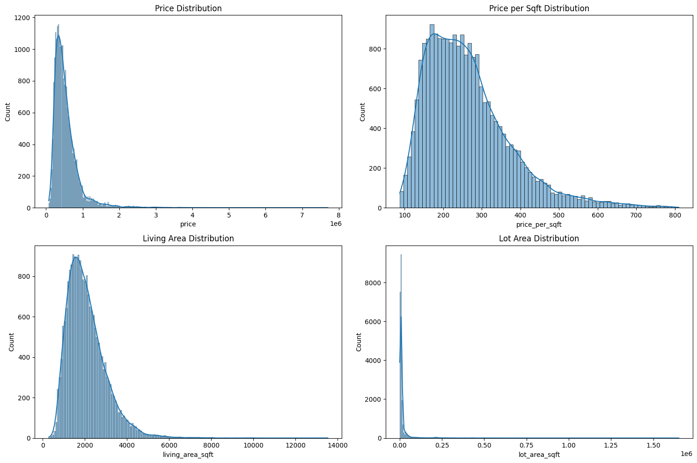
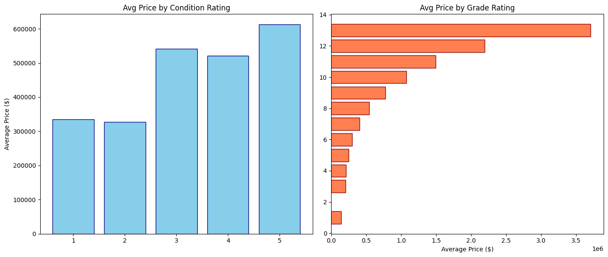

# House Price Analysis

## Project Overview
This project analyzes house pricing data based on features such as square footage, number of bedrooms and bathrooms, house age, and renovation history. The goal is to explore the dataset, perform feature engineering, visualize relationships, and extract actionable insights.

## Dataset
The dataset includes:
- `price`: Price of the house
- `living_area_sqft`: House size in square feet
- `bedrooms` & `bathrooms`
- `year_built` & `year_renovated`
- `date` of sale

## Workflow

1. **Data Loading & Understanding**
   - Read the CSV file.
   - Checked data types and null values.
   - Detected and handled outliers.

2. **Feature Engineering**
   - Extracted `year`, `month`, and `day` from the sale date.
   - Calculated `price_per_sqft` = price / living area.
   - Created `total_rooms` = bedrooms + bathrooms.
   - Calculated `bathroom_ratio` = bathrooms / bedrooms.
   - Calculated `house_age` = year of sale - year built.
   - Calculated `years_since_renovation` (negative values set to 0).
   - Categorized bedrooms into `Small`, `Medium`, `Large`, `Huge`.

3. **Data Visualization**
   - Explored relationships between price, size, rooms, and other features.
   - Created scatter plots, histograms, bar charts, and correlation heatmaps.
   - some visualizations below
   - 
   - 

4. **Insights**
   - Newly renovated houses have higher price per square foot.
   - Price increases with living area and total number of rooms.
   - Houses with more bedrooms tend to have a lower bathroom ratio.
   - Categorizing bedrooms helps identify pricing trends across house sizes.

## Libraries Used
- `pandas` and `numpy` – Data manipulation  
- `matplotlib`, `seaborn`, `plotly` – Data visualization  

## Next Steps / Recommendations
- Implement machine learning models to predict house prices.  
- Include location-based features for improved predictions.  
- Build an interactive dashboard for better exploration and presentation.  

## 👤 Author
**Shubham Mandavkar**  
Aspiring Data Analyst | Excel | Power BI | SQL | Python | R Programming

